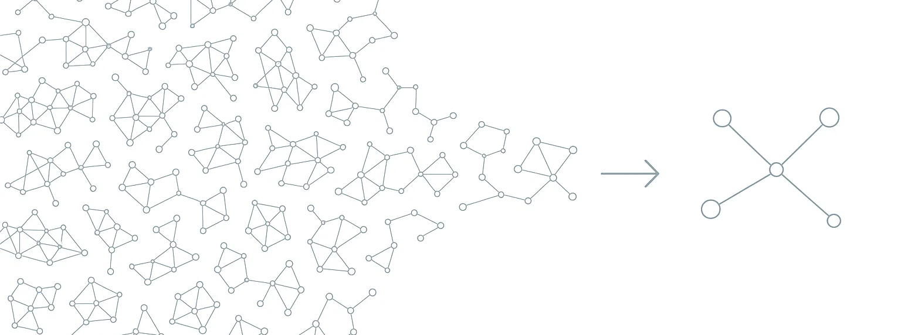

Cosmic Graphs
=============

Overview
--------

One of the core philosophies of **Thema** is to embrace the variability inherent in unsupervised learning. Instead of forcing you to choose a single "best" set of hyperparameters (and thus a single graph representation), Thema generates a "multiverse" of graphs across a grid of parameters.

While this multiverse is powerful for finding robust clusters, interpreting hundreds of graphs can be daunting. The **Cosmic Graph** solves this by collapsing the entire multiverse into a single, unified graph structure to capture insights from the ensemble.

.. note::
    Our framework uses Mapper graphs where nodes typically represent *clusters* of items. In the **Cosmic Graph**, nodes represent **individual items** (e.g., specific coal plants, documents, or data points).

How It Works
------------

The Cosmic Graph is constructed by measuring how frequently models in the multiverse cluster elements together—whether they share the same node or belong to the same connected component in a Mapper graph. Our thesis is that when many models consistently group elements together, this represents a stronger, more robust connection across multiple scales.

This ensemble approach reduces our reliance on any single hyperparameter choice, which is particularly valuable given the sensitivity of Mapper graphs to parameter settings (see `Any Graph is a Mapper Graph <https://arxiv.org/abs/2408.11180>`_). By aggregating co-occurrence probabilities across models, we construct a **Pseudo-Laplacian** matrix that can be represented as a weighted graph and used in downstream graph analytics and clustering—with fewer parameters and better interpretability.

Here is a more detailed breakdown of the process:

1.  **Pseudo-Laplacian Computation**: For each graph in the multiverse (a "Star"), we compute a matrix encoding item relationships. If two items appear in the same node (cluster) within a Star, we count this as a co-occurrence.
2.  **Aggregation**: We sum these matrices across all Stars. Relationships that are stable—appearing consistently across many different parameter settings—accumulate high weights in the summed matrix.
3.  **Cosmic Graph Construction**: The aggregated matrix is converted into a weighted graph:

    - **Nodes**: The original data items
    - **Edges**: Weighted connections representing the stability and strength of relationships across the multiverse

This approach filters out noise—relationships that only exist under specific, fragile parameter settings—while amplifying the signal from relationships that persist regardless of parameter choices.

Configuration
-------------

The Cosmic Graph is an **opt-in** feature. To enable it, you must add the ``cosmic_graph`` section to your ``params.yaml`` file under ``Galaxy``. If this section is omitted, the Cosmic Graph will not be computed.

.. code-block:: yaml

    Galaxy:
      # ... other galaxy params ...
      cosmic_graph:
        enabled: true          # Required to enable
        neighborhood: "cc"     # "cc" (connected components) or "node"
        threshold: 0.0         # Minimum weight threshold for edges

Usage
-----

The Cosmic Graph is automatically computed as the final step of the ``galaxy_genesis`` pipeline.

.. code-block:: python

    from thema import Thema

    # Initialize and run the pipeline
    t = Thema("params.yaml")
    t.genesis()

    # Access the Cosmic Graph
    cosmic_graph = t.cosmicGraph

    # It is a standard NetworkX graph
    import networkx as nx
    print(f"Nodes: {cosmic_graph.number_of_nodes()}")
    print(f"Edges: {cosmic_graph.number_of_edges()}")

Visualization and Interoperability
----------------------------------

Because the Cosmic Graph's nodes correspond one-to-one with your original data items, it is significantly easier to interpret and visualize than abstract cluster-based graphs.

You can export this graph to tools like **Gephi** or **Neo4j** for exploration, or integrate it directly with other graph-based agents and analysis pipelines.

.. code-block:: python

    # Example: Export to GEXF for Gephi
    nx.write_gexf(cosmic_graph, "cosmic_graph.gexf")

    # Example: Inspect the strongest connections for a specific item
    item_id = 0  # Replace with a valid item index
    neighbors = sorted(cosmic_graph[item_id].items(), key=lambda x: x[1]['weight'], reverse=True)
    
    print(f"Top connections for item {item_id}:")
    for neighbor, data in neighbors[:5]:
        print(f"  -> Item {neighbor} (Weight: {data['weight']:.2f})")

API Reference
-------------

.. currentmodule:: thema.multiverse.universe.galaxy

.. automethod:: Galaxy.compute_cosmicGraph
